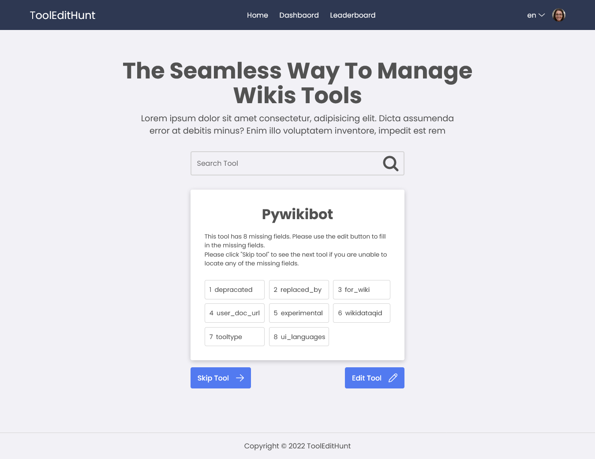

# ToolHuntEdit

ToolHuntEdit Public Link [ToolHuntEdit](https://tools-edit-hunt.vercel.app/)

## Table of Content:

-   [About The App](#about-the-app)
-   [Screenshots](#screenshots)
-   [Technologies](#technologies)
-   [Test](#test)
-   [Setup](#setup)
-   [Approach](#approach)
-   [Status](#status)
-   [Credits](#credits)

## About The App

Toolhub is a collection of tools utilized by numerous Wiki projects. The quantity and caliber of the information it includes directly affects its usefulness as such. Many of the tools in Toolhub currently have missing or insufficient information.

**ToolHuntEdit**  is a web application that is streamlined and gamified to make editing faster and more enjoyable on Toolhub.


## Screenshots



Web App V1

## Technologies

The frontend architecture use `Nextjs` as the JavaScript Framework written in `TypeScript` and Using `SCSS (Modular CSS)` for UI Styling.

Other secondary technologies used on this project includes:

-   `Jest`
-   `React Testing Library`
-   `Prettier`
-   `ESLint`


## Test

This project is covered with Unit tests written in `React Testing Library` and `Jest`.

Run component tests

```bash

yarn test
```

## Setup

### Download or clone the repository

### Install dependencies

```bash

yarn install
```

### After, run the development server:

```bash

yarn dev
```

Open [http://localhost:8080](http://localhost:8080) with your browser to see the result.

## Approach

Approach:

## Status

**ToolHuntEdit** development is still in progress. `Version 1` will be out soon.

## Credits

List of contriubutors:

-   [Oluwatobi Adeyokunnu](https://tobianointing.github.io/)

